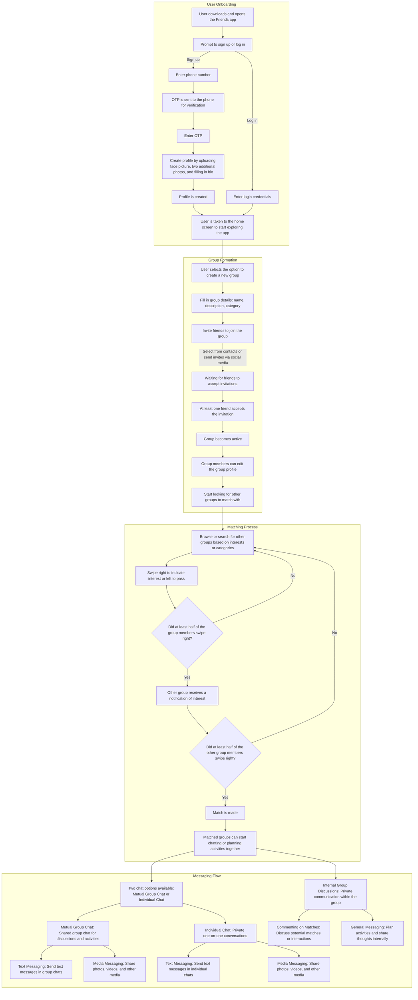

```mermaid
graph TD
    %% User Onboarding Subgraph
    subgraph User Onboarding
        A[User downloads and opens the Friends app] --> B[Prompt to sign up or log in]
        B -->|Sign up| C[Enter phone number]
        C --> D[OTP is sent to the phone for verification]
        D --> E[Enter OTP]
        E --> F[Create profile by uploading face picture, two additional photos, and filling in bio]
        F --> G[Profile is created]
        G --> H[User is taken to the home screen to start exploring the app]
        B -->|Log in| I[Enter login credentials]
        I --> H[User is taken to the home screen to start exploring the app]
    end

    %% Group Formation Subgraph
    subgraph Group Formation
        H --> J[User selects the option to create a new group]
        J --> K[Fill in group details: name, description, category]
        K --> L[Invite friends to join the group]
        L -->|Select from contacts or send invites via social media| M[Waiting for friends to accept invitations]
        M --> N[At least one friend accepts the invitation]
        N --> O[Group becomes active]
        O --> P[Group members can edit the group profile]
        P --> Q[Start looking for other groups to match with]
    end

    %% Matching Process Subgraph
    subgraph Matching Process
        Q --> R[Browse or search for other groups based on interests or categories]
        R --> S[Swipe right to indicate interest or left to pass]
        S --> T{Did at least half of the group members swipe right?}
        T -->|Yes| U[Other group receives a notification of interest]
        T -->|No| R
        U --> V{Did at least half of the other group members swipe right?}
        V -->|Yes| W[Match is made]
        V -->|No| R
        W --> X[Matched groups can start chatting or planning activities together]
    end

    %% Messaging Flow Subgraph
    subgraph Messaging Flow
        X --> Y[Two chat options available: Mutual Group Chat or Individual Chat]
        Y --> Z1[Mutual Group Chat: Shared group chat for discussions and activities]
        Y --> Z2[Individual Chat: Private one-on-one conversations]
        Z1 --> AA1[Text Messaging: Send text messages in group chats]
        Z1 --> AA2[Media Messaging: Share photos, videos, and other media]
        Z2 --> BB1[Text Messaging: Send text messages in individual chats]
        Z2 --> BB2[Media Messaging: Share photos, videos, and other media]
        X --> CC[Internal Group Discussions: Private communication within the group]
        CC --> DD1[Commenting on Matches: Discuss potential matches or interactions]
        CC --> DD2[General Messaging: Plan activities and share thoughts internally]
    end
```